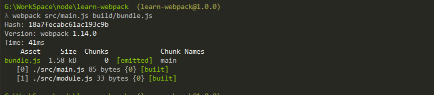
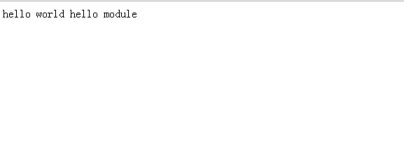
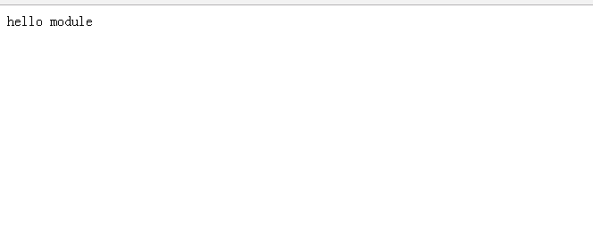
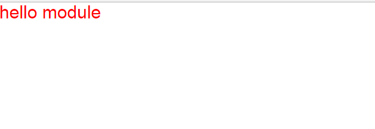
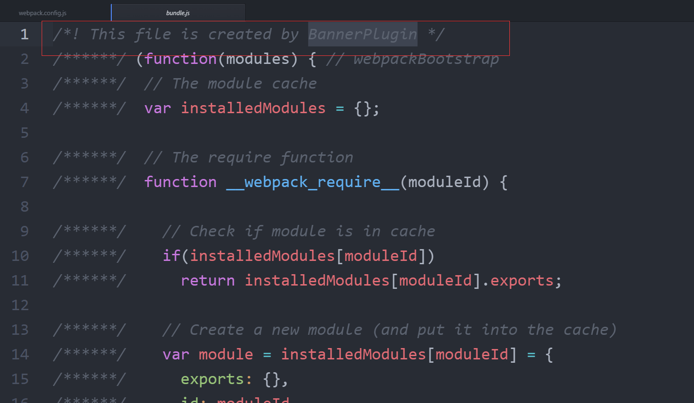

# 半小时学会webpack

学习webpack，只需要记得一句话，**一切皆模块**

最好的学习网站--[官方网站](http://webpack.github.io/)，没有之一。

### 什么是webpack，为什么要使用它？
Webpack 是当下最热门的前端资源模块化管理和打包工具。它可以将许多松散的模块按照依赖和规则打包成符合生产环境部署的前端资源。还可以将按需加载的模块进行代码分隔，等到实际需要的时候再异步加载。通过 `loader` 的转换，任何形式的资源都可以视作模块，比如 `CommonJs` 模块、 `AMD` 模块、 `ES6` 模块、`CSS`、图片、 `JSON`、`Coffeescript`、 `LESS` 等。

### 开始

#### 安装

首先要安装 Node.js， Node.js 自带了软件包管理器 npm，Webpack 需要 Node.js v0.6 以上支持，建议使用最新版 Node.js。

全局安装

	npm install webpack -g

依赖安装

	npm install webpack --save-dev

安装成功可以使用命令行**webpack -h**进行测试。
#### 基本使用

1 新建一个空的文件夹，命名为**learn-webpack**,终端进入该文件夹后输入下面命令初始化项目上。    

	   	npm init  

输入这个命令后，终端会问你一系列诸如项目名称，项目描述，作者等信息，不过不用担心，如果你不准备在npm中发布你的模块，这些问题的答案都不重要，回车默认即可。

2 安装完成后，接着安装webpack

		// 安装Webpack
		npm install webpack -g

3 在当前项目中新建两个空的文件夹**src**文件夹和**build**文件夹,**src**文件夹用来存放原始数据和我们将写的JavaScript模块，**build**文件夹用来存放浏览器访问的页面。在这里还需要创建三个文件，`index.html` 文件放在build文件夹中，两个js文件（`main.js`和`module.js`）放在**src**文件夹中，此时项目结构结构如下

		learn-webpack
			build
				index.html
			src
				main.js
				module.js
			node_modules
			package.json

`index.html`文件只有最基础的html代码，它唯一的目的就是加载打包后的js文件（bundle.js）

	<!DOCTYPE html>
	<html lang="en">
	  <head>
	    <meta charset="utf-8">
	    <title>learn webpack</title>
	  </head>
	  <body>
	    

	    

	    
	  </body>
	</html>

`main.js`

	document.getElementById('app').innerHTML = "hello world " + require('./module.js');

`module.js`

	module.exports = 'hello module';

4. 使用webpack生成**bundle.js**

		webpack {entry file/入口文件} {destination for bundled file/存放bundle.js的地方}

只需要指定一个入口文件，webpack将自动识别项目所依赖的其它文件。

		webpack src/main.js build/bundle.js

运行如下

现在打开index.html,可以看到如下结果

有没有感觉很神奇，现在我们已经学会使用命令行打包文件了，但每次使用命令行感觉不是很方便，我们再看另外一种方法，使用配置文件来打包。

还是继续上面的例子来说明如何写这个配置文件，在当前练习文件夹的根目录下新建一个名为**webpack.config.js**的文件，并在其中进行最最简单的配置，如下所示，它包含入口文件路径和存放打包后文件的地方的路径。

	///webpack.config.js
	module.exports = {
	  entry:  __dirname + "/src/main.js",//已多次提及的唯一入口文件
	  output: {
	    path: __dirname + "/build",//打包后的文件存放的地方
	    filename: "bundle.js"//打包后输出文件的文件名
	  }
	}

>注：“__dirname”是node.js中的一个全局变量，它指向当前执行脚本所在的目录。

	webpack

这条命令会自动参考webpack.config.js文件中的配置选项打包你的项目,你会看到和你刚才一样的效果。

又学会了一种使用Webpack的方法，而且不用管那烦人的命令行参数了，有没有感觉很爽。
还有一种更快捷的执行打包任务，就是使用**npm**脚本。

修改package.json

	{
	  "name": "learn-webpack",
	  "version": "1.0.0",
	  "description": "",
	  "main": "index.js",
	  "dependencies": {
	    "webpack": "^1.14.0"
	  },
	  "devDependencies": {},
	  "scripts": {
	    "build":"webpack",
	    "test": "echo \"Error: no test specified\" && exit 1"
	  },
	  "author": "",
	  "license": "ISC"
	}

然后终端运行

	npm run build

是不是也和刚才一样的效果。

5 其它配置

5.1 Source Maps（使调试更容易）

开发总是离不开调试，如果可以更加方便的调试当然就能提高开发效率，不过打包后的文件有时候你是不容易找到出错了的地方对应的源代码的位置的，Source Maps就是来帮我们解决这个问题的。

在webpack的配置文件中配置source maps，需要配置`devtool`，它有以下四种不同的配置选项，各具优缺点，描述如下：

|devtool选项|	说明|
|----------:|--------:|
|source-map	|在一个单独的文件中产生一个完整且功能完全的文件。这个文件具有最好的source map，但是它会减慢打包文件的构建速度；|
|cheap-module-source-map	|在一个单独的文件中生成一个不带列映射的map，不带列映射提高项目构建速度，但是也使得浏览器开发者工具只能对应到具体的行，不能对应到具体的列（符号），会对调试造成不便；|
|eval-source-map	|使用eval打包源文件模块，在同一个文件中生成干净的完整的source map。这个选项可以在不影响构建速度的前提下生成完整的sourcemap，但是对打包后输出的JS文件的执行具有性能和安全的隐患。不过在开发阶段这是一个非常好的选项，但是在生产阶段一定不要用这个选项；|
|cheap-module-eval-source-map	|这是在打包文件时最快的生成source map的方法，生成的Source Map 会和打包后的JavaScript文件同行显示，没有列映射，和eval-source-map选项具有相似的缺点；|

正如上表所述，上述选项由上到下打包速度越来越快，不过同时也具有越来越多的负面作用，较快的构建速度的后果就是对打包后的文件的的执行有一定影响。

在在小到中型的项目上，`eval-source-map`是一个很好的选项，不过记得只在开发阶段使用它,在生产环境使用`source-map`，继续上面的例子，进行如下配置

修改`webpack.config.js`

	///webpack.config.js
	module.exports = {
	  devtool: 'source-map',//配置生成Source Maps，选择合适的选项
	  entry:  __dirname + "/src/main.js",//已多次提及的唯一入口文件
	  output: {
	    path: __dirname + "/build",//打包后的文件存放的地方
	    filename: "bundle.js"//打包后输出文件的文件名
	  }
	}

然后终端运行

	npm run build

就会在`build`里面生成Source Maps。

#### webpack构建本地服务器

想不想让你的浏览器监测你都代码的修改，并自动刷新修改后的结果，其实Webpack提供一个可选的本地开发服务器，这个本地服务器基于node.js构建，可以实现你想要的这些功能，不过它是一个单独的组件，在webpack中进行配置之前需要单独安装它作为项目依赖或者全局安装

全局安装

	npm install -g webpack-dev-server

依赖安装

	npm install --save-dev webpack-dev-server

配置选项

|配置名称|描述|
|------:|--:|
|contentBase|默认webpack-dev-server会为根文件夹提供本地服务器，如果想为另外一个目录下的文件提供本地服务器，应该在这里设置其所在目录（本例设置到**build**目录）|
|port|	设置默认监听端口，如果省略，默认为**8080**|
|inline|	设置为true，当源文件改变时会自动刷新页面|
|colors|	设置为true，使终端输出的文件为彩色的|
|historyApiFallback|	在开发单页应用时非常有用，它依赖于HTML5 history API，如果设置为true，所有的跳转将指向index.html|

修改webpack.config.js

	module.exports = {
	  devtool: 'source-map',//配置生成Source Maps，选择合适的选项
	  entry: __dirname + "/src/main.js", //已多次提及的唯一入口文件
	  output: {
	    path: __dirname + "/build", //打包后的文件存放的地方
	    filename: "bundle.js" //打包后输出文件的文件名
	  },
	  devServer: {
	    contentBase: "./build", //本地服务器所加载的页面所在的目录
	    colors: true, //终端中输出结果为彩色
	    historyApiFallback: true, //不跳转
	    inline: true //实时刷新
	  }
	}

#### Loader

Webpack 本身只能处理 JavaScript 模块，如果要处理其他类型的文件，就需要使用 `loader` 进行转换。

`Loader` 可以理解为是模块和资源的转换器，它本身是一个函数，接受源文件作为参数，返回转换的结果。这样，我们就可以通过 `require` 来加载任何类型的模块或文件，比如 CoffeeScript、 JSX、 LESS 或图片。

Loaders需要单独安装并且需要在`webpack.config.js`下的`modules`关键字下进行配置，Loaders的配置选项包括以下几方面：

* `test`：一个匹配loaders所处理的文件的拓展名的正则表达式（必须）
* `loader`：loader的名称（必须）
* `include/exclude`:手动添加必须处理的文件（文件夹）或屏蔽不需要处理的文件（文件夹）（可选）；
* `query`：为loaders提供额外的设置选项（可选）

1. 接着上面的例子，现在如果我们需要添加外部的`json`文件，作为文字的配置。如果直接`require('./config.json')`,肯定是会报错的，因为它不认识`json`,所有就需要专门的`loader`去处理`json`

	//安装可以装换JSON的loader
	npm install --save-dev json-loader

修改webpack.config.js中的`module`

	module.exports = {
    devtool: 'source-map',//配置生成Source Maps，选择合适的选项
	  entry: __dirname + "/src/main.js", //已多次提及的唯一入口文件
	  output: {
	    path: __dirname + "/build", //打包后的文件存放的地方
	    filename: "bundle.js" //打包后输出文件的文件名
	  },
	  devServer: {
	    contentBase: "./build", //本地服务器所加载的页面所在的目录
	    colors: true, //终端中输出结果为彩色
	    historyApiFallback: true, //不跳转
	    inline: true //实时刷新
	  },
	  module: { //在配置文件里添加JSON loader
	    loaders: [{
	      test: /\.json$/,
	      loader: "json"
	    }]
	  }
	}

其它文件修改

`main.js`

	var config = require('./config.json');
	document.getElementById('app').innerHTML = config.main + require('./module.js');

`module.js`

	var config = require('./config.json');
	document.getElementById('app').innerHTML = config.main + require('./module.js');

`config.json`

	{
	  "main": "hello world",
	  "module": "hello module"
	}

终端运行查看效果

	webpack-dev-server

效果和刚才一样的，只是文字被单独放在了配置文件中。

>注意：`webpack-dev-server`不会生成到`build`, 只是被加载到内存当中。

##### Loader结合Babel

Babel其实是一个编译JavaScript的平台，它的强大之处表现在可以通过编译帮你达到以下目的：

* 下一代的JavaScript标准（ES6，ES7），这些标准目前并未被当前的浏览器完全的支持；
* 使用基于JavaScript进行了拓展的语言，比如React的JSX

>[更多介绍](http://babeljs.io/)

2.1 安装

	npm install babel-loader  babel-core babel-preset-react babel-preset-es2015 webpack --save-dev

2.2 添加`.babelrc`

	{
	  "presets": ["react", "es2015"]
	}

2.3 安装 `react`

	npm install --save react react-dom

修改webpack.config.js中的`module`

	module.exports = {
	  devtool: 'source-map',//配置生成Source Maps，选择合适的选项
	  entry: __dirname + "/src/main.js", //已多次提及的唯一入口文件
	  output: {
	    path: __dirname + "/build", //打包后的文件存放的地方
	    filename: "bundle.js" //打包后输出文件的文件名
	  },
	  devServer: {
	    contentBase: "./build", //本地服务器所加载的页面所在的目录
	    colors: true, //终端中输出结果为彩色
	    historyApiFallback: true, //不跳转
	    inline: true //实时刷新
	  },
	  module: { //在配置文件里添加JSON loader
	    loaders: [{
	        test: /\.json$/,
	        loader: "json"
	      },
	      {
	        test: /\.js$/,
	        exclude: /node_modules/,
	        loader: 'babel' //在webpack的module部分的loaders里进行配置即可
	      }
	    ]
	  }
	}

其它文件修改

`main.js`

	import React from 'react';
	import {render} from 'react-dom';
	import Module from './module';

	render(<Module />, document.getElementById('app'));

`module.js`

	import React, {Component} from 'react'
	import config from './config.json';

	class Module extends Component{
	  render() {
	    return (
	      

	        {config.module}
	      

	    );
	  }
	}

	export default Module

终端运行查看效果

	webpack-dev-server

现在整体项目已经变成了`react`项目了

##### 如何处理`css`、`images`

webpack提供两个`loader`处理样式表，`css-loader` 和 `style-loader`，二者处理的任务不同，`css-loader`使你能够使用类似@import 和 url(...)的方法实现 require()的功能,`style-loader`将所有的计算后的样式加入页面中，二者组合在一起使你能够把样式表嵌入webpack打包后的JS文件中。

接着上面的例子

	//安装
	npm install --save-dev style-loader css-loader

修改`webpack.config.js`

	module.exports = {
    devtool: 'source-map',//配置生成Source Maps，选择合适的选项
	  entry: __dirname + "/src/main.js", //已多次提及的唯一入口文件
	  output: {
	    path: __dirname + "/build", //打包后的文件存放的地方
	    filename: "bundle.js" //打包后输出文件的文件名
	  },
	  devServer: {
	    contentBase: "./build", //本地服务器所加载的页面所在的目录
	    colors: true, //终端中输出结果为彩色
	    historyApiFallback: true, //不跳转
	    inline: true //实时刷新
	  },
	  module: { //在配置文件里添加JSON loader
	    loaders: [{
	        test: /\.json$/,
	        loader: "json"
	      },
	      {
	        test: /\.js$/,
	        exclude: /node_modules/,
	        loader: 'babel' //在webpack的module部分的loaders里进行配置即可
	      },
	      {
	        test: /\.css$/,
	          loader: 'style!css' //添加对样式表的处理 感叹号的作用在于使同一文件能够使用不同类型的loader
	        }
	    ]
	  }
	}

>loader中感叹号的作用在于使同一文件能够使用不同类型的loader

接着在src中添加`main.css`，并写入基本样式

	* {
	  margin: 0;
	  padding: 0;
	  font-family: 'Helvetica Neue', Helvetica, Arial, sans-serif;
	}

	body {
	  color: red;
	  font-size: 30px;
	}

然后在`main.js`添加`main.css`

	import React from 'react';
	import {render} from 'react-dom';
	import Module from './module';

	import './main.css';//使用import导入css文件

	render(<Module />, document.getElementById('app'));

终端运行查看效果

	webpack-dev-server

#### 插件（Plugins）

插件可以完成更多 `loader` 不能完成的功能。

插件的使用一般是在 `webpack` 的配置信息 `plugins` 选项中指定。

`Webpack` 本身内置了一些常用的插件，还可以通过 `npm` 安装第三方插件。

接下来，我们利用一个最简单的 `BannerPlugin` 内置插件来实践插件的配置和运行，这个插件的作用是给输出的文件头部添加注释信息。

修改 webpack.config.js，添加 plugins：

	var webpack = require('webpack');

	module.exports = {
    devtool: 'source-map',//配置生成Source Maps，选择合适的选项
	  entry: __dirname + "/src/main.js", //已多次提及的唯一入口文件
	  output: {
	    path: __dirname + "/build", //打包后的文件存放的地方
	    filename: "bundle.js" //打包后输出文件的文件名
	  },
	  devServer: {
	    contentBase: "./build", //本地服务器所加载的页面所在的目录
	    colors: true, //终端中输出结果为彩色
	    historyApiFallback: true, //不跳转
	    inline: true //实时刷新
	  },
	  module: { //在配置文件里添加JSON loader
	    loaders: [{
	        test: /\.json$/,
	        loader: "json"
	      },
	      {
	        test: /\.js$/,
	        exclude: /node_modules/,
	        loader: 'babel' //在webpack的module部分的loaders里进行配置即可
	      },
	      {
	        test: /\.css$/,
	        loader: 'style!css' //添加对样式表的处理 感叹号的作用在于使同一文件能够使用不同类型的loader
	      }
	    ]
	  },
	  plugins: [
	    new webpack.BannerPlugin('This file is created by zhaoda')
	  ]
	}

终端运行,查看生成的`bundle.js`效果

	webpack

##### HtmlWebpackPlugin

这个插件的作用是依据一个简单的模板，帮你生成最终的Html5文件，这个文件中自动引用了你打包后的JS文件。每次编译都在文件名中插入一个不同的哈希值。

安装

	npm install --save-dev html-webpack-plugin

这个插件自动完成了我们之前手动做的一些事情，在正式使用之前需要对一直以来的项目结构做一些改变：

移除build文件夹，利用此插件，HTML5文件会自动生成，此外CSS已经通过前面的操作打包到JS中了，src文件夹里。

在src目录下，创建一个Html文件模板，这个模板包含title等其它你需要的元素，在编译过程中，本插件会依据此模板生成最终的html页面，会自动添加所依赖的 css, js，favicon等文件，在本例中我们命名模板文件名称为index.tmpl.html，模板源代码如下

`index.tmpl.html`

	<!DOCTYPE html>
	<html lang="en">
	  <head>
	    <meta charset="utf-8">
	    <title>learn webpack</title>
	  </head>
	  <body>
	    

	    

	    
	  </body>
	</html>

修改 `webpack.config.js`，添加 `plugins`：

	var webpack = require('webpack');
	var HtmlWebpackPlugin = require('html-webpack-plugin');

	module.exports = {
    devtool: 'source-map',//配置生成Source Maps，选择合适的选项
	  entry: __dirname + "/src/main.js", //已多次提及的唯一入口文件
	  output: {
	    path: __dirname + "/build", //打包后的文件存放的地方
	    filename: "bundle.js" //打包后输出文件的文件名
	  },
	  devServer: {
	    contentBase: "./build", //本地服务器所加载的页面所在的目录
	    colors: true, //终端中输出结果为彩色
	    historyApiFallback: true, //不跳转
	    inline: true //实时刷新
	  },
	  module: { //在配置文件里添加JSON loader
	    loaders: [{
	        test: /\.json$/,
	        loader: "json"
	      },
	      {
	        test: /\.js$/,
	        exclude: /node_modules/,
	        loader: 'babel' //在webpack的module部分的loaders里进行配置即可
	      },
	      {
	        test: /\.css$/,
	        loader: 'style!css' //添加对样式表的处理 感叹号的作用在于使同一文件能够使用不同类型的loader
	      }
	    ]
	  },
	  plugins: [
	    new webpack.BannerPlugin('This file is created by BannerPlugin'),
	    new HtmlWebpackPlugin({
	      template: __dirname + "/src/index.tmpl.html" //new 一个这个插件的实例，并传入相关的参数
	    })
	  ]
	}

终端运行,查看生成的效果,会自动帮我们生成`build`文件夹，并且把生成的文件添加到里面。

	webpack

### 高级运用

目前为止，我们已经使用webpack构建了一个完整的开发环境。但是在产品阶段，可能还需要对打包的文件进行额外的处理，比如说优化，压缩，缓存以及分离CSS和JS。

我们需要添加`webpack.production.config.js`，这个文件和之前的`webpack.config.js`，差不多，只是去掉了`devServer`选项，因为我们在部署的时候都有专门的web服务器，不会使用`webpack-dev-server`.

修改`package.json`

	{
	  "name": "learn-webpack",
	  "version": "1.0.0",
	  "description": "",
	  "main": "index.js",
	  "dependencies": {
		...
	  },
	  "devDependencies": {
		...
	  },
	  "scripts": {
	    "start": "webpack-dev-server",
	    "build":"webpack --config ./webpack.production.config.js",
	    "test": "echo \"Error: no test specified\" && exit 1"
	  },
	  "author": "",
	  "license": "ISC"
	}

常用优化插件

* `UglifyJsPlugin`：压缩JS代码；
* `extractTextPlugin`：分离CSS和JS文件

> `UglifyJS plugins` 都是内置插件,不需要安装

安装`extract-text-webpack-plugin`

	npm install --save-dev extract-text-webpack-plugin

修改 `webpack.config.js`，添加 `plugins`：

	var webpack = require('webpack');
	var HtmlWebpackPlugin = require('html-webpack-plugin');
	var ExtractTextPlugin = require('extract-text-webpack-plugin');

	module.exports = {
	  devtool: 'source-map',
	  entry: __dirname + "/src/main.js", //已多次提及的唯一入口文件
	  output: {
	    path: __dirname + "/build", //打包后的文件存放的地方
	    filename: "bundle.js" //打包后输出文件的文件名
	  },
	  module: { //在配置文件里添加JSON loader
	    loaders: [{
	        test: /\.json$/,
	        loader: "json"
	      },
	      {
	        test: /\.js$/,
	        exclude: /node_modules/,
	        loader: 'babel' //在webpack的module部分的loaders里进行配置即可
	      },
	      {
	        test: /\.css$/,
	        loader: ExtractTextPlugin.extract('style', 'css')
	      }
	    ]
	  },
	  plugins: [
	    new webpack.BannerPlugin('This file is created by BannerPlugin'),
	    new HtmlWebpackPlugin({
	      template: __dirname + "/src/index.tmpl.html" //new 一个这个插件的实例，并传入相关的参数
	    }),
	    new webpack.optimize.UglifyJsPlugin(),
	    new ExtractTextPlugin("style.css")
	  ]
	}

终端运行,查看生成的效果,会自动帮我们生成`build`文件夹，里面会分离出`main.css`和`boundle.js`

	npm run build

接下来就可以把生成的文件部署到生产服务器了。

### 总结

`webpack`是一个非常好用的的工具，使用它可以节约很多的时间，提高我们的开发效率，大家就是更多的时候出去`撩妹`。感谢大家可以看完这篇比较长的文章。

参考资料

>
